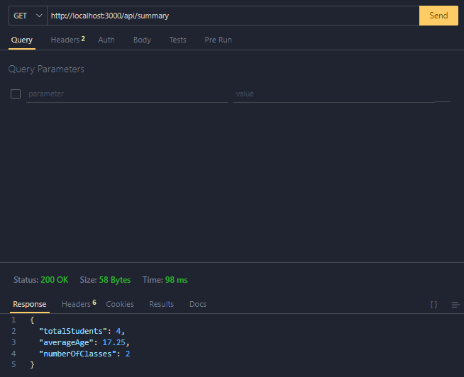
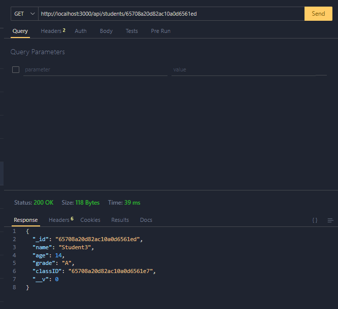
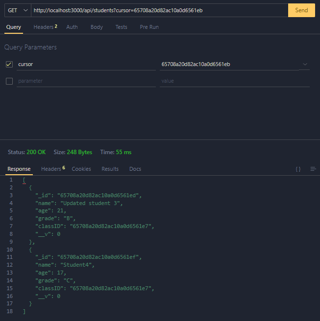
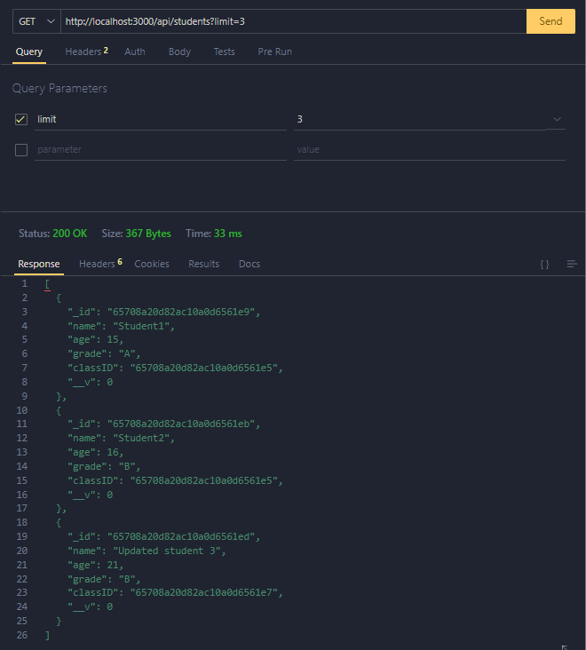
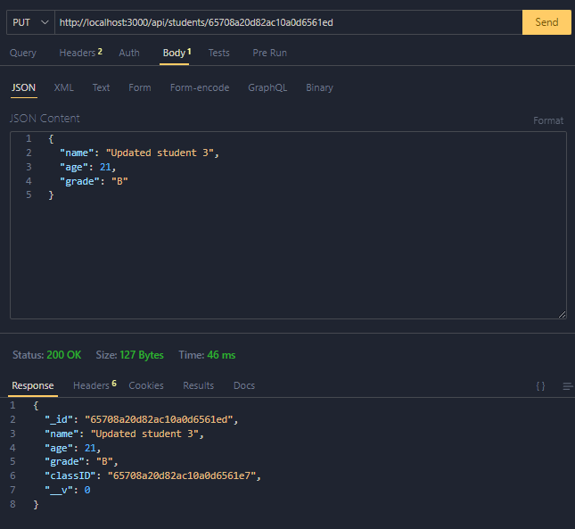
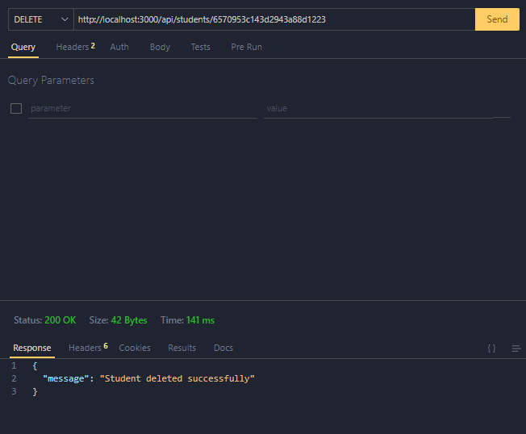
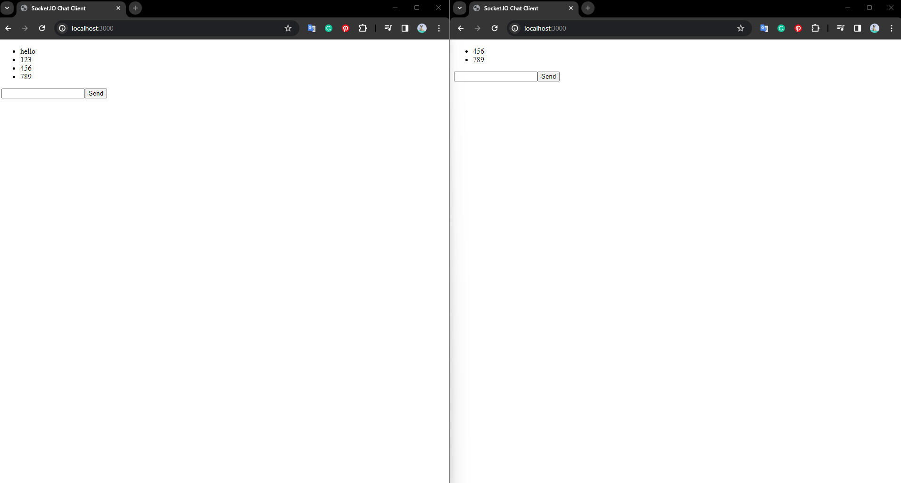

# Idea Theorem Skill Test

## Overview

This repository contains a Node.js application that demonstrates the implementation of a Data Aggregation System, Real-Time Communication Feature, and a Basic API with Scalability Considerations.

## Table of Contents

- Setup
- API Interaction
- Real-Time Communication
- Scalability Considerations
- Specific Requirements and Deliverables

## Setup

Follow these steps to set up the project locally:

### Clone the Repository:

```bash
git clone <repository-url>
cd idea-theorem-skilltest
```

### Environment Variables:

Create a .env file in the project root and configure the following variables:

```bash
DATABASE_URL=
```

### Install Dependencies:

```bash
npm i
```

### Build Docker Image:

```bash
docker-compose up --build
```

### Run the app:

Once the build is complete, you can start the containers using:

```bash
docker-compose up
```

The application will be running at http://localhost:3000.

## API Interaction

### Data Aggregation System

#### Endpoint for Data Summaries:

- **Method:** GET
- **URL:** http://localhost:3000/api/summary
- **Response:** JSON object with summaries.
  

#### Endpoint for Retrieving Student Details by ID:

- **Method:** GET
- **URL:** http://localhost:3000/api/students/{id}
  - Replace {id} with the specific student ID.
  - example id: 65708a20d82ac10a0d6561e9
    

#### Endpoint for Listing Students with Cursor-based Pagination:

- **Method:** GET
- **URL:** http://localhost:3000/api/students?cursor={cursor}
  - Replace {cursor} with the cursor value for pagination.
  - example cursor value: 65708a20d82ac10a0d6561ed
    
    

#### Endpoint for Adding a New Student:

- **Method:** POST
- **URL:** http://localhost:3000/api/students
- **Body:** JSON object representing the new student. - example body:
  `bash
    {
  "name": "John Jason Pham",
  "age": 20,
  "grade": "A",
  "classID": "65708a20d82ac10a0d6561e5"
}
    `
  

#### Endpoint for Updating Student Information:

- **Method:** PUT
- **URL:** http://localhost:3000/api/students/{id}
  - Replace {id} with the specific student ID.
- **Body:** JSON object with updated information. - example id: 65708a20d82ac10a0d6561ed - example body:
  `bash
{
  "name": "Updated student 3",
  "age": 22,
  "grade": "A"
}
    `
  

#### Endpoint for Removing a Student:

- **Method:** DELETE
- **URL:** http://localhost:3000/api/students/{id}
  - Replace {id} with the specific student ID.
    

### Real-Time Communication

The application includes a real-time chat system using Socket.IO.

#### WebSocket Connection:

- **URL:** http://localhost:3000
  - Connect to this URL using a WebSocket client.
    

## Report

### Summary of Approach

My approach to building this application was centered around the following key principles:

1. **Modularity:** I structured the application with modularity in mind, separating concerns into different modules such as the API, real-time communication, and database models.

2. **Scalability:** The API was designed to handle scalability concerns, incorporating cursor-based pagination to efficiently manage large datasets.

3. **Real-Time Communication:** The integration of Socket.IO provided a seamless real-time chat system, enhancing user interaction within the application.

### Challenges Encountered

While developing the application, I faced several challenges:

1. **WebSockets Configuration:** Configuring and integrating Socket.IO for real-time communication required careful consideration of potential issues and ensuring a smooth WebSocket connection.

2. **Cursor-based Pagination:** Implementing cursor-based pagination posed challenges in handling edge cases, ensuring proper sorting, and optimizing query performance.

3. **Docker Setup:** Configuring Docker and Docker Compose to ensure a seamless setup for developers and testers required careful attention to environment variables and dependencies.

### Solutions Implemented

To overcome the challenges, I implemented the following solutions:

1. **WebSockets Configuration:** I thoroughly reviewed the Socket.IO documentation and implemented best practices for configuring and handling WebSocket connections.

2. **Cursor-based Pagination:** I conducted thorough testing and debugging to address issues related to cursor-based pagination, ensuring correct sorting and optimal query performance.

3. **Docker Setup:** I provided clear instructions in the README for setting up the application using Docker, ensuring that developers and testers can easily replicate the environment.
